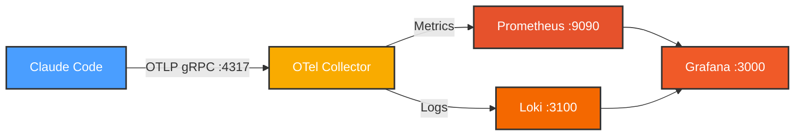
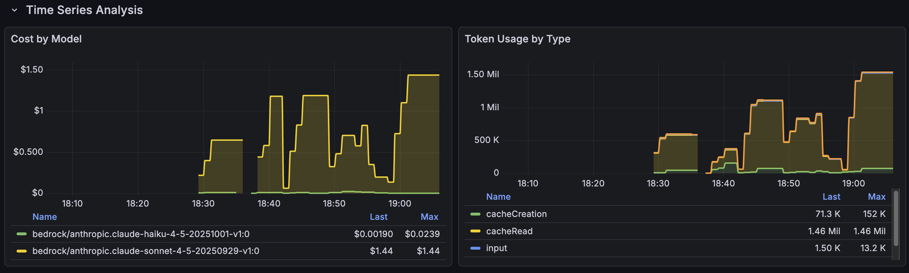
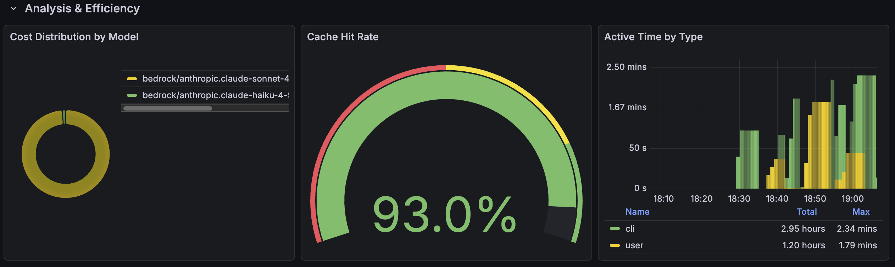
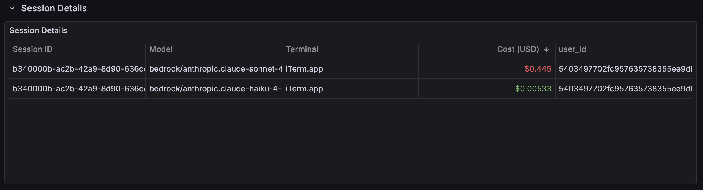
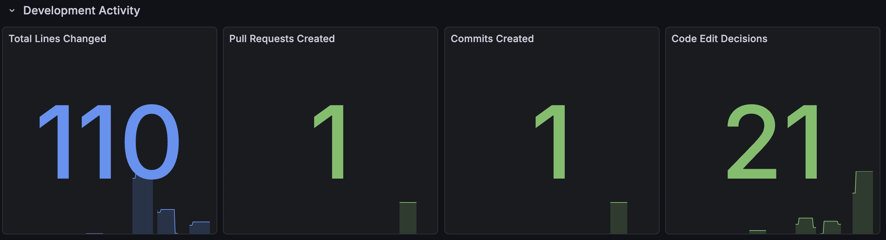
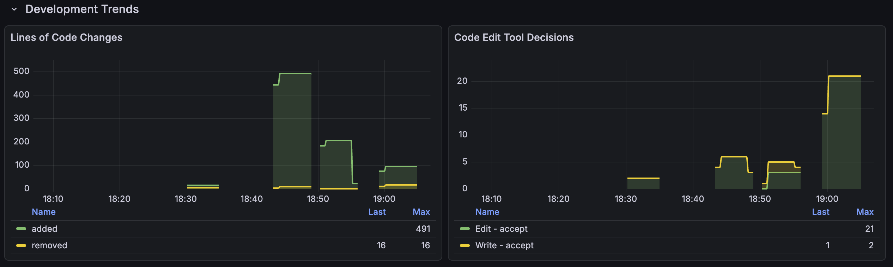
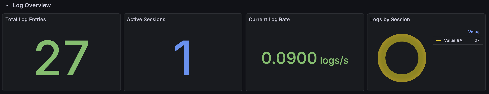
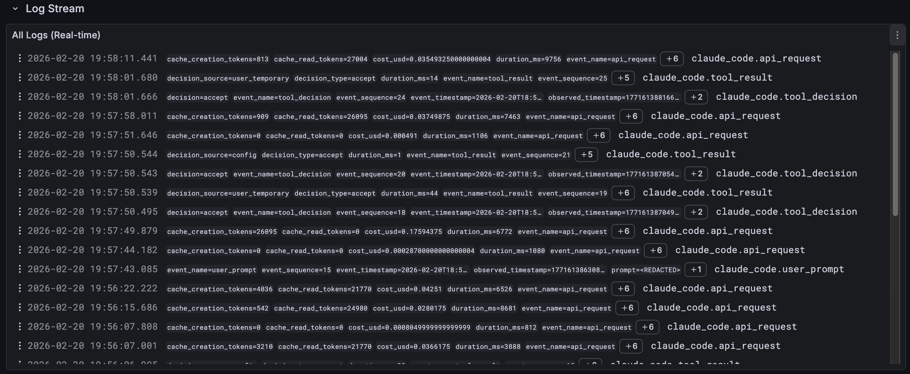
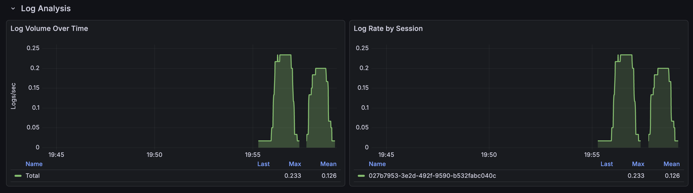
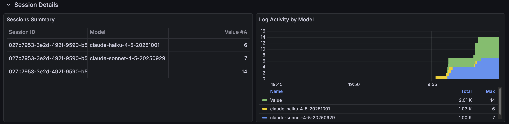

# Claude Code Monitoring Stack

Monitor Claude Code usage, costs, and performance using OpenTelemetry, Prometheus, Loki, and Grafana.

> **Tested with**: Claude Code CLI v2.1.38  
> **Environment**: macOS with Colima (Docker Desktop alternative)

## ⚠️ Environment Note

This setup was developed and tested using [Colima](https://github.com/abiosoft/colima) on macOS. While it should work with Docker Desktop and other Docker environments, there may be networking or volume mounting differences. If you encounter issues on other platforms, please check your Docker configuration.

## Architecture



## Dashboard Preview

### Metrics Dashboard
*URL: http://localhost:3000/d/claude-code-monitoring*

| Panel | Preview |
|-------|---------|
| **Summary Statistics** | [](images/dashboard/metrics/01-dashboard-summary-stats.png) |
| **Time Series Analysis** | [](images/dashboard/metrics/02-dashboard-time-series.png) |
| **Analysis & Efficiency** | [](images/dashboard/metrics/03-dashboard-analysis-efficiency.png) |
| **Session Details** | [](images/dashboard/metrics/04-dashboard-session-details.png) |
| **Development Activity** | [](images/dashboard/metrics/05-dashboard-dev-activity.png) |
| **Development Trends** | [](images/dashboard/metrics/06-dashboard-dev-trends.png) |

### Logs Dashboard
*URL: http://localhost:3000/d/claude-code-logs*

| Panel | Preview | Description |
|-------|---------|-------------|
| **Log Overview** | [](images/dashboard/logs/01-logs-overview.png) | Total entries, active sessions, log rate, distribution |
| **Real-time Stream** | [](images/dashboard/logs/02-logs-stream.png) | Live streaming log viewer |
| **Log Analysis** | [](images/dashboard/logs/03-logs-analysis.png) | Volume over time, rate by session |
| **Session Details** | [](images/dashboard/logs/04-logs-session-details.png) | Sessions table, activity by model |

## Prerequisites

- Docker and Docker Compose installed
- Claude Code CLI v2.1+ installed
- Port 3000, 3100, 4317, 8889, 9090 available

## Quick Start

### 1. Run Setup Script

```bash
./setup.sh
```

This automatically:
- Starts all services
- Configures Grafana data sources
- Imports metrics and logs dashboards

### 2. Enable Telemetry

Edit `~/.claude/settings.json`:

```json
{
  "env": {
    "CLAUDE_CODE_ENABLE_TELEMETRY": "1",
    "OTEL_METRICS_EXPORTER": "otlp",
    "OTEL_LOGS_EXPORTER": "otlp",
    "OTEL_EXPORTER_OTLP_PROTOCOL": "grpc",
    "OTEL_EXPORTER_OTLP_ENDPOINT": "http://localhost:4317"
  }
}
```

Restart Claude Code to apply changes.

### 3. View Dashboards

Open Grafana dashboards:
- **Metrics**: http://localhost:3000/d/claude-code-monitoring
- **Logs**: http://localhost:3000/d/claude-code-logs

Generate some telemetry:

```bash
claude "test telemetry"
```

## What's Tracked

- **Token usage** - Input, output, cache reads/writes
- **API costs** - Per model (Sonnet, Haiku, etc.)
- **Session activity** - Active time, session count
- **Cache efficiency** - Cache hit rates
- **Development metrics** - Lines changed, commits, pull requests
- **Code editing** - Tool decisions and outcomes
- **Logs** - Real-time streaming logs with session-level analysis

## Service URLs

| Service | URL | Purpose |
|---------|-----|---------|
| Grafana | http://localhost:3000 | Dashboard UI |
| Metrics Dashboard | http://localhost:3000/d/claude-code-monitoring | Token usage, costs, development activity |
| Logs Dashboard | http://localhost:3000/d/claude-code-logs | Real-time log streaming and analysis |
| Prometheus | http://localhost:9090 | Metrics query UI |
| Loki | http://localhost:3100 | Logs API |

## Common Commands

```bash
# Stop services (data preserved)
docker-compose down

# Stop and delete all data
docker-compose down -v

# View logs
docker-compose logs -f otel-collector

# Restart services
docker-compose restart

# Check status
docker-compose ps
```

## Data Persistence

Your data is **automatically saved** in Docker volumes:
- Metrics history (Prometheus)
- Log history (Loki)
- Dashboard settings (Grafana)

Data persists across restarts. To reset completely:
```bash
docker-compose down -v
./setup.sh
```

## Available Metrics

> [!TIP]
> **Official Documentation**: [Claude Code Monitoring & Usage](https://code.claude.com/docs/en/monitoring-usage)


> [!NOTE]
> Metric names below use Prometheus format (dots → underscores, counters get `_total` suffix). Original OpenTelemetry metric names use dots (e.g., `claude_code.cost.usage` becomes `claude_code_cost_usage_USD_total`).*


| Metric | Description |
|--------|-------------|
| `claude_code_cost_usage_USD_total` | Total cost in USD |
| `claude_code_token_usage_tokens_total` | Token count by type |
| `claude_code_active_time_seconds_total` | Active session time |
| `claude_code_session_count_total` | Number of sessions |
| `claude_code_lines_of_code_count_total` | Lines of code changed (added/removed) |
| `claude_code_pull_request_count_total` | Pull requests created via Claude Code |
| `claude_code_commit_count_total` | Git commits created via Claude Code |
| `claude_code_code_edit_tool_decision_total` | Code edit tool decisions (accept/reject) |

### Example Prometheus Queries

**Total spending:**
```promql
sum(claude_code_cost_usage_USD_total)
```

**Cache efficiency:**
```promql
sum(claude_code_token_usage_tokens_total{type="cacheRead"}) /
(sum(claude_code_token_usage_tokens_total{type="cacheRead"}) +
 sum(claude_code_token_usage_tokens_total{type="input"}))
```

**Cost per hour:**
```promql
rate(claude_code_cost_usage_USD_total[1h]) * 3600
```

## Troubleshooting

### No data appearing?

1. Verify telemetry is enabled:
   ```bash
   cat ~/.claude/settings.json
   ```
   Should show `CLAUDE_CODE_ENABLE_TELEMETRY: "1"`

2. Check services are running:
   ```bash
   docker-compose ps
   ```
   All should show "Up"

3. Check OTel Collector is receiving data:
   ```bash
   docker-compose logs otel-collector | grep -i received
   ```

4. Verify Prometheus is scraping:
   ```bash
   curl -s http://localhost:9090/api/v1/targets | jq '.data.activeTargets[].health'
   ```

### Port already in use?

Edit `docker-compose.yml` and change port mappings:
```yaml
ports:
  - "13000:3000"  # Use 13000 instead of 3000
```

### Colima-specific issues?

- Check Colima is running: `colima status`
- Verify Docker socket: `docker ps`
- Try restarting: `colima restart`

### Dashboard shows "No Data"?

1. Generate some telemetry: `claude "echo test"`
2. Wait 10-15 seconds for data to propagate
3. Check Prometheus has data: `curl -s http://localhost:8889/metrics | grep claude_code`

## Security Note

⚠️ This setup uses **anonymous admin access** in Grafana for ease of use. This is suitable for local development only. Do not expose these services to the internet.
