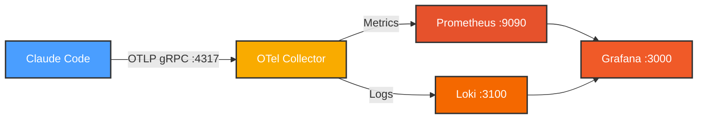

# Claude Code Monitoring Stack

Monitor Claude Code usage, costs, and performance using OpenTelemetry, Prometheus, Loki, and Grafana.

## Architecture



## Quick Start

### 1. Run Setup Script

```bash
./setup.sh
```

This will:
- Start all services (OTel Collector, Prometheus, Loki, Grafana)
- Configure Grafana data sources
- Import the monitoring dashboard

### 2. Enable Telemetry

Edit `~/.claude/settings.json`:

```json
{
  "env": {
    "CLAUDE_CODE_ENABLE_TELEMETRY": "1",
    "OTEL_METRICS_EXPORTER": "otlp",
    "OTEL_LOGS_EXPORTER": "otlp",
    "OTEL_EXPORTER_OTLP_PROTOCOL": "grpc",
    "OTEL_EXPORTER_OTLP_ENDPOINT": "http://localhost:4317"
  }
}
```

### 3. View Dashboard

Open http://localhost:3000/d/claude-code-monitoring

Run any Claude Code command to generate telemetry:
```bash
claude "test telemetry"
```

## What's Tracked

- **Token usage** (input, output, cache reads/writes)
- **API costs** by model
- **Session activity** (active time, session count)
- **Cache efficiency**

## Service URLs

| Service | URL |
|---------|-----|
| Grafana | http://localhost:3000 |
| Prometheus | http://localhost:9090 |
| Loki | http://localhost:3100 |

## Common Commands

```bash
# Stop all services
docker-compose down

# View logs
docker-compose logs -f otel-collector

# Restart services
docker-compose restart
```

## Metrics

| Metric | Description |
|--------|-------------|
| `claude_code_cost_usage_USD_total` | Total cost in USD |
| `claude_code_token_usage_tokens_total` | Token count by type |
| `claude_code_active_time_seconds_total` | Active session time |
| `claude_code_session_count_total` | Number of sessions |

### Example Queries

**Total cost:**
```promql
sum(claude_code_cost_usage_USD_total)
```

**Cache hit rate:**
```promql
sum(claude_code_token_usage_tokens_total{type="cacheRead"}) /
(sum(claude_code_token_usage_tokens_total{type="cacheRead"}) +
 sum(claude_code_token_usage_tokens_total{type="input"}))
```

## Troubleshooting

**No data appearing?**
1. Check telemetry is enabled: `cat ~/.claude/settings.json`
2. Verify services are running: `docker-compose ps`
3. Check OTel Collector logs: `docker-compose logs otel-collector`

**Port conflicts?**
Edit `docker-compose.yml` to change port mappings.
